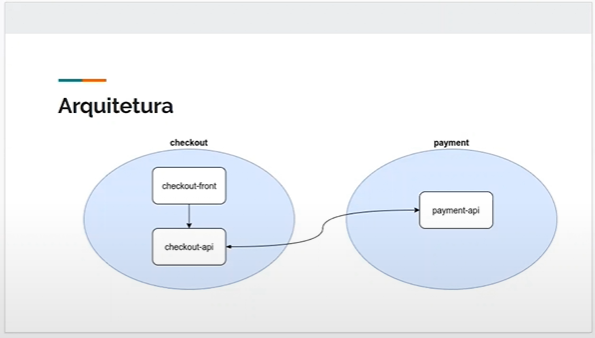

# e-commerce com microsserviços

Projeto com arquitetura de microsserviços e orientado a eventos com Apache Kafka


## Requirements
* Git
* Java 8
* Docker
* IntelliJ Community
* Spring Boot
* [Spring Cloud Streams](https://spring.io/projects/spring-cloud-stream#overview)
* [Schema Registry](https://docs.confluent.io/platform/current/schema-registry/index.html)
* Apache Kafka


### Docker

```shell script
e-commerce\ecommerce-checkout-api\docker> docker-compose up --build
```


## Sources
* checkout-api
* payment-api
* checkout-front-end

